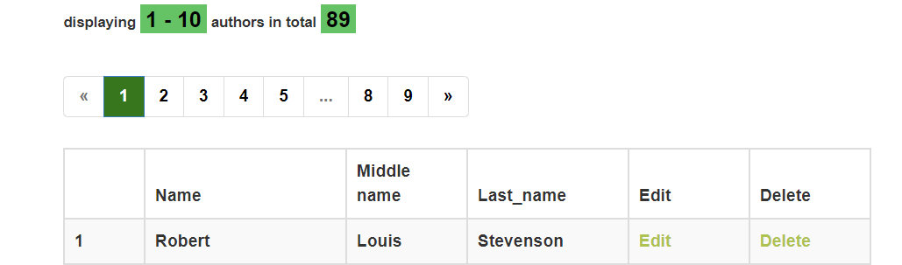
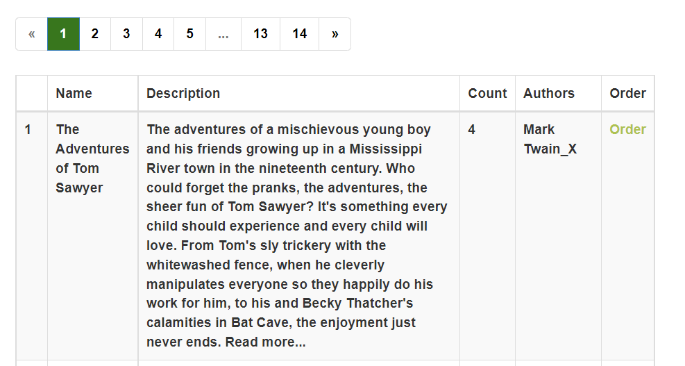

Library
Vision
“Library” is web-application which allows librarians to record information about books, authors, users and the book
orders. For library users app allows see info about books and authors and order  book.
Application should provide:
• Storing book orders, users, books and authors in a database;
• Display list of books;
• Updating the list of books (adding, editing, removing);
• Display list of authors;
• Updating the list of authors (adding, editing, removing);
• Filtering by different criteria for books;
1. Orders
1.1 Display list of orders
The mode is designed to view the list of orders, if it possible to display the number of orders for a specified
period of time and also display users which don’t returned books at time.
Main scenario:
• User selects item “Orders”;
• Application displays list of Orders.
Pic. 1.1 View the Orders list.
   
The list displays the following columns:
• User username;
• Book name;
• Add date – date of order creation;
   
2. Authors
2.1 Display list of authors
This mode is intended for viewing and editing the authors list
Main scenario:
• User selects item “Authors”;
• Application displays list of authors.
Pic. 2.1 View the authors list.
   
The list displays the following columns:
• Author name – author name;
• Author Middle name – author Middle name;
• Author Last name – author Last name;

2.2 Add author  (available only for librarians)
Main scenario:
• User clicks the “Add Author” button in the authors list view mode;
• Application displays form to enter author data;
• User enters author data and presses “Submit” button;
• If any data is entered incorrectly, incorrect data messages are displayed;
• If entered data is valid, then record is adding to database;
• If error occurs, then error message is displaying;
• If new author record is successfully added, then list of authors with added records is displaying.

Pic. 2.2 Add author
When adding an author, the following details are entered:
• Author name – author name;
• Author Middle name – author Middle name;
• Author Last name – author Last name;
Constraints for data validation:
• Author name – author name;
• Author Middle name – author Middle name;
• Author Last name – author Last name;

2.3 Edit author  (available only for librarians)
Main scenario:
• User clicks the “Edit” button in the authors list view mode;
• Application displays form to enter author data;
• User enters book data and presses “Save” button;
• If any data is entered incorrectly, incorrect data messages are displayed;
• If entered data is valid, then edited data is added to database;
• If error occurs, then error message is displaying;
• If author record is successfully edited, then list of authors with added records is displaying.

Pic. 3.3 Edit author.
2.4 Removing the author (available only for librarians)
Main scenario:
• The user, while in the list of authors mode, presses the "Delete" button in the selected author line;
• Record is deleted from database;
• If error occurs, then error message displays;
• If author record is successfully deleted, then list of authors without deleted records is displaying.

Pic. 3.4 Delete author dialog.
Cancel operation scenario: 
• User is in display mode of authors list and press “Delete” button; 
• Application displays confirmation dialog “Please confirm delete author?”; 
• User press “Cancel” button; • List of authors without changes is displaying. 

3. Books
3.1 Display list of books
This mode is intended for viewing and editing the books list
Main scenario:
• User selects item “Books”;
• Application displays list of books.
Pic. 3.1 View the books list.
The list displays the following columns:
• Book name – book’s name;
• Book description – book’s description;
• Number of books in library.
Filtering by author:
• In the books list view mode, the user sets an author id  filter and presses the refresh list button ;
• The application will display  the list of books with updated data.
Filtering by count:
• In the books list view mode, the user sets a count  filter and presses the refresh list button (;
• The application will display  the list of books with updated data.
Filtering by name:
• In the books list view mode, the user sets a name_contains
filter and presses the refresh list button ;
• The application will display  the list of books with updated data;
• In the books list view mode, the user sets a description_contains
filter and presses the refresh list button ;
• The application will display  the list of books with updated data.

3.2 Add book (available only for librarians)
Main scenario:
• User clicks the “Add book” button in the books list view mode;
• Application displays form to enter book data;
• User enters car data and presses “Submit” button;
• If any data is entered incorrectly, incorrect data messages are displayed;
• If entered data is valid, then record is adding to database;
• If error occurs, then error message is displaying;
• If new book record is successfully added, then list of books with added records is displaying.
Pic. 3.2 Add book

When adding a book, the following details are entered:
• Book name – book name;
• Book description – book description;
• Count  – count of books in the library;
• Author  – book author;
Constraints for data validation:
• Book name – maximum length of 30 characters;
• Book description – maximum length of 90 characters;
• Count  – 0<=count<=100;
• Author  – book author;

3.3 Edit book (available only for librarians)
Main scenario:
• User clicks the “Edit” button in the books list view mode;
• Application displays form to enter book data;
• User enters book data and presses “Submit” button;
• If any data is entered incorrectly, incorrect data messages are displayed;
• If entered data is valid, then edited data is added to database;
• If error occurs, then error message is displaying;
• If book record is successfully edited, then list of books with added records is displaying.
Pic. 3.3 Edit book.

3.4 Removing the book (available only for librarians)
Main scenario:
• The user, while in the list of books mode, presses the "Delete" button in the selected book line;
• Record is deleted from database;
Pic. 3.4 Delete book dialog.

Cancel operation scenario: 
• User is in display mode of books list and press “Delete” button; 
• Application displays confirmation dialog “Please confirm delete book”; 
• User press “Cancel” button; 
• List of authors without changes is displaying. 

3.5 Add order
Main scenario:
• User clicks the “Order” button in the books list view mode;
• record is adding to database;
• If new order record is successfully added, then list of orders of the user with added record is displaying.
Pic. 1.2 Add order.

